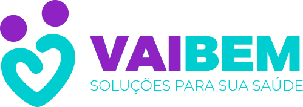

<h1 align="center">
Vai Bem Front-end
</h1>

<p align="center">Front-end (API) do projeto para teste na Vai Bem</p>

<hr>
<center>

  
</center>
<hr>


# Desafio
Construir uma aplicação que mostre todos os dados e ações possíveis que utilizam a API criada no desafio back-end.

## Principais Tecnologias utilizadas
- [React](https://pt-br.reactjs.org/)
- [Typescript](https://www.typescriptlang.org/)
- [Styled Components](https://styled-components.com/)
- [Ant Design](https://ant.design/)
- [React Bootstrap](https://react-bootstrap.netlify.app/)
- [Axios](https://www.npmjs.com/package/axios)
- [react-modal](https://github.com/reactjs/react-modal)


## Uso

```bash
# Faça um clone do projeto
$ git clone [url do projeto]

# acesse a pasta
$ cd [pasta]

# Instale as  dependencias
$ yarn install

# rodando o servidor
$ yarn start
```

acesse [http://localhost:3000](http://localhost:3000) no seu navegador

---

Made with care by Diego Araujo :wave: [Get in touch!](https://www.linkedin.com/in/diegooliveiradearaujo)
